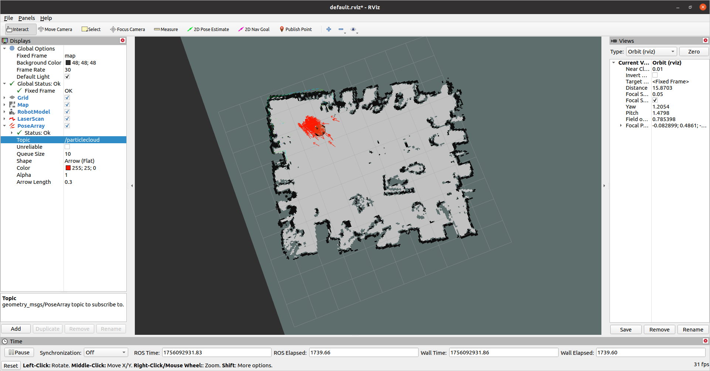
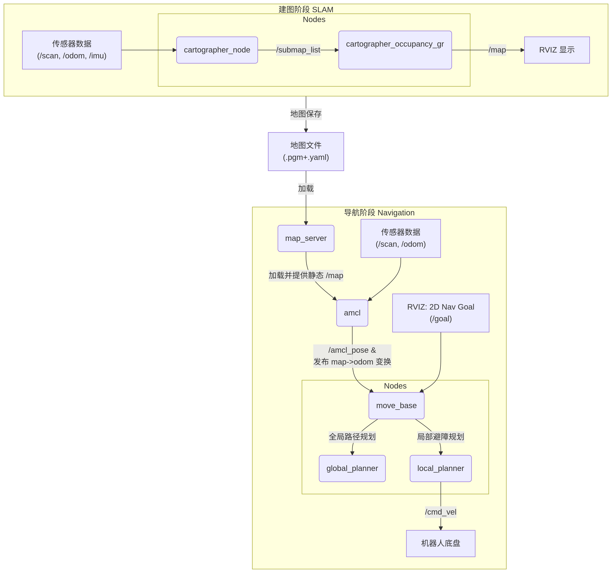

# Slam Notes


---

<!-- source: SLAM建图笔记/GMapping安装与配置.md -->

# GMapping安装与配置

https://zhuanlan.zhihu.com/p/262287388

1.安装包

```
sudo apt update
```

```
sudo apt-get install ros-noetic-gmapping 
```

> [!NOTE]
>
> 根据自己的<ros-distro>版本替换noetic

2.在自己的工作空间内添加gmapping.launch文件

```
<launch>
    <arg name="scan_topic" default="scan" />                  <!-- 根据自己发布scan名称进行修改 -->
    <node pkg="gmapping" type="slam_gmapping" name="slam_gmapping" output="screen" clear_params="true">
        <param name="base_frame" value="base_footprint"/>     <!-- 根据自己的基座标系名称进行修改 -->
        <param name="odom_frame" value="odom"/>               <!-- 根据自己的里程计坐标系名称进行修改 -->
        <param name="map_update_interval" value="4.0"/>
        <!-- Set maxUrange < actual maximum range of the Laser -->
        <param name="maxRange" value="5.0"/>
        <param name="maxUrange" value="4.5"/>
        <param name="sigma" value="0.05"/>
        <param name="kernelSize" value="1"/>
        <param name="lstep" value="0.05"/>
        <param name="astep" value="0.05"/>
        <param name="iterations" value="5"/>
        <param name="lsigma" value="0.075"/>
        <param name="ogain" value="3.0"/>
        <param name="lskip" value="0"/>
        <param name="srr" value="0.01"/>
        <param name="srt" value="0.02"/>
        <param name="str" value="0.01"/>
        <param name="stt" value="0.02"/>
        <param name="linearUpdate" value="0.5"/>
        <param name="angularUpdate" value="0.436"/>
        <param name="temporalUpdate" value="-1.0"/>
        <param name="resampleThreshold" value="0.5"/>
        <param name="particles" value="80"/>
        <param name="xmin" value="-1.0"/>
        <param name="ymin" value="-1.0"/>
        <param name="xmax" value="1.0"/>
        <param name="ymax" value="1.0"/>
        <param name="delta" value="0.05"/>
        <param name="llsamplerange" value="0.01"/>
        <param name="llsamplestep" value="0.01"/>
        <param name="lasamplerange" value="0.005"/>
        <param name="lasamplestep" value="0.005"/>
        <remap from="scan" to="$(arg scan_topic)"/>
    </node>
</launch>
```

3.启动gmapping

```
roslaunch <你的包> gmapping.launch
```

4.如果要用手柄控制

```
sudo apt-get install ros-<distro>-joy ros-noetic-teleop-twist-joy
```

新建launch文件 gmapping_joy.launch

```
<launch>
    <arg name="scan_topic" default="scan" />
    
    <!-- 手柄控制节点 -->
    <node pkg="joy" type="joy_node" name="joy_node" output="screen">
        <param name="dev" value="/dev/input/js0" />
        <param name="deadzone" value="0.3" />
        <param name="autorepeat_rate" value="20" />
    </node>

    <node pkg="teleop_twist_joy" type="teleop_node" name="teleop_twist_joy" output="screen">
        <param name="enable_button" value="0" />  <!-- 通常为A按钮 -->
        <param name="enable_turbo_button" value="-1" />  <!-- 禁用turbo模式 -->
        <param name="axis_linear" value="1" />    <!-- 通常为左摇杆上下 -->
        <param name="axis_angular" value="0" />   <!-- 通常为左摇杆左右 -->
        <param name="scale_linear" value="1.0" />  <!-- 线速度限制为1 嫌慢的可以提升到4--> 
        <param name="scale_angular" value="1.0" /> <!-- 角速度限制为1 嫌慢的可以提升到4-->
    </node>

    <!-- GMAPPING SLAM节点 -->
    <node pkg="gmapping" type="slam_gmapping" name="slam_gmapping" output="screen" clear_params="true">
        <param name="base_frame" value="base_footprint"/>
        <param name="odom_frame" value="odom"/>
        <param name="map_update_interval" value="4.0"/>
        <param name="maxRange" value="5.0"/>
        <param name="maxUrange" value="4.5"/>
        <param name="sigma" value="0.05"/>
        <param name="kernelSize" value="1"/>
        <param name="lstep" value="0.05"/>
        <param name="astep" value="0.05"/>
        <param name="iterations" value="5"/>
        <param name="lsigma" value="0.075"/>
        <param name="ogain" value="3.0"/>
        <param name="lskip" value="0"/>
        <param name="srr" value="0.01"/>
        <param name="srt" value="0.02"/>
        <param name="str" value="0.01"/>
        <param name="stt" value="0.02"/>
        <param name="linearUpdate" value="0.5"/>
        <param name="angularUpdate" value="0.436"/>
        <param name="temporalUpdate" value="-1.0"/>
        <param name="resampleThreshold" value="0.5"/>
        <param name="particles" value="80"/>
        <param name="xmin" value="-1.0"/>
        <param name="ymin" value="-1.0"/>
        <param name="xmax" value="1.0"/>
        <param name="ymax" value="1.0"/>
        <param name="delta" value="0.05"/>
        <param name="llsamplerange" value="0.01"/>
        <param name="llsamplestep" value="0.01"/>
        <param name="lasamplerange" value="0.005"/>
        <param name="lasamplestep" value="0.005"/>
        <remap from="scan" to="$(arg scan_topic)"/>
    </node>
</launch>
```

启动

```
roslaunch <你的包> gmapping_joy.launch
```


---

<!-- source: SLAM建图笔记/Move_base安装与配置.md -->

# Move_base安装与配置

https://zhuanlan.zhihu.com/p/428332784

## 安装

```
sudo apt install ros-<ROS版本>-navigation
```

## launch文件

```
<launch>

    <node pkg="move_base" type="move_base" respawn="false" name="move_base" output="screen" clear_params="true">
        <rosparam file="$(find 功能包)/param/costmap_common_params.yaml" command="load" ns="global_costmap" />
        <rosparam file="$(find 功能包)/param/costmap_common_params.yaml" command="load" ns="local_costmap" />
        <rosparam file="$(find 功能包)/param/local_costmap_params.yaml" command="load" />
        <rosparam file="$(find 功能包)/param/global_costmap_params.yaml" command="load" />
        <rosparam file="$(find 功能包)/param/base_local_planner_params.yaml" command="load" />
    </node>

</launch>
```

启动了 move_base 功能包下的 move_base 节点，respawn 为 false，意味着该节点关闭后，不会被重启；clear_params 为 true，意味着每次启动该节点都要清空私有参数然后重新载入；通过 rosparam 会载入若干 yaml 文件用于配置参数

### costmap_common_params.yaml

该文件是move_base 在全局路径规划与本地路径规划时调用的通用参数，包括:机器人的尺寸、距离障碍物的安全距离、传感器信息等。配置参考如下:

```yaml
#机器人几何参，如果机器人是圆形，设置 robot_radius,如果是其他形状设置 footprint
robot_radius: 0.12 #圆形
# footprint: [[-0.12, -0.12], [-0.12, 0.12], [0.12, 0.12], [0.12, -0.12]] #其他形状
# 四个角的坐标


obstacle_range: 3.0 # 用于障碍物探测，比如: 值为 3.0，意味着动态检测到距离小于 3 米的障碍物时，就会引入代价地图
raytrace_range: 3.5 # 用于清除障碍物，比如：值为 3.5，意味着动态清除代价地图中 3.5 米以外的障碍物


#膨胀半径，扩展在碰撞区域以外的代价区域，使得机器人规划路径避开障碍物
inflation_radius: 0.2
#代价比例系数，越大则代价值越小
cost_scaling_factor: 3.0

#地图类型
map_type: costmap

#导航包所需要的传感器
observation_sources: scan
#对传感器的坐标系和数据进行配置。这个也会用于代价地图添加和清除障碍物。例如，你可以用激光雷达传感器用于在代价地图添加障碍物，再添加kinect用于导航和清除障碍物。
scan: {sensor_frame: laser, data_type: LaserScan, topic: scan, marking: true, clearing: true}
```

### global_costmap_params.yaml

该文件用于全局代价地图参数设置:

```yaml
global_costmap:
  global_frame: map #地图坐标系
  robot_base_frame: base_footprint #机器人坐标系
  # 以此实现坐标变换

  update_frequency: 1.0 #代价地图更新频率
  publish_frequency: 1.0 #代价地图的发布频率
  transform_tolerance: 0.5 #等待坐标变换发布信息的超时时间

  static_map: true # 是否使用一个地图或者地图服务器来初始化全局代价地图，如果不使用静态地图，这个参数为false.
```

### local_costmap_params.yaml

该文件用于局部代价地图参数设置:

```yaml
local_costmap:
  global_frame: odom #里程计坐标系
  robot_base_frame: base_footprint #机器人坐标系

  update_frequency: 10.0 #代价地图更新频率
  publish_frequency: 10.0 #代价地图的发布频率
  transform_tolerance: 0.5 #等待坐标变换发布信息的超时时间

  static_map: false  #不需要静态地图，可以提升导航效果
  rolling_window: true #是否使用动态窗口，默认为false，在静态的全局地图中，地图不会变化
  width: 3 # 局部地图宽度 单位是 m
  height: 3 # 局部地图高度 单位是 m
  resolution: 0.05 # 局部地图分辨率 单位是 m，一般与静态地图分辨率保持一致
```

### 参数配置技巧

以上配置在实操中，可能会出现机器人在本地路径规划时与全局路径规划不符而进入膨胀区域出现假死的情况，如何尽量避免这种情形呢？（Molodic之前的版本经常出现上述情形）

全局路径规划与本地路径规划虽然设置的参数是一样的，但是二者路径规划和避障的职能不同，可以采用不同的参数设置策略:

- **全局代价地图可以将膨胀半径和障碍物系数设置的偏大一些**；
- **本地代价地图可以将膨胀半径和障碍物系数设置的偏小一些**。

这样，在全局路径规划时，规划的路径会尽量远离障碍物，而本地路径规划时，机器人即便偏离全局路径也会和障碍物之间保留更大的自由空间，从而避免了陷入“假死”的情形。

### launch文件集成

如果要实现导航，需要集成地图服务、amcl 、move_base 与 [Rviz](https://zhida.zhihu.com/search?content_id=183314410&content_type=Article&match_order=1&q=Rviz&zhida_source=entity) 等，集成示例如下:

```xml
<launch>
    <!-- 设置地图的配置文件 -->
    <arg name="map" default="nav.yaml" />
    <!-- 运行地图服务器，并且加载设置的地图-->
    <node name="map_server" pkg="map_server" type="map_server" args="$(find mycar_nav)/map/$(arg map)"/>
    <!-- 启动AMCL节点 -->
    <include file="$(find mycar_nav)/launch/amcl.launch" />

    <!-- 运行move_base节点 -->
    <include file="$(find mycar_nav)/launch/path.launch" />
    <!-- 运行rviz -->
    <node pkg="rviz" type="rviz" name="rviz" args="-d $(find mycar_nav)/rviz/nav.rviz" />

</launch>
```


---

<!-- source: SLAM建图笔记/ROS环境接入摄像头.md -->

# ROS环境接入摄像头

基于libuvc库搭建

https://wiki.ros.org/libuvc_camera


## 1.判别摄像头是否为UVC摄像头

通过以下指令检查摄像头是否已经连接

```bash
lsusb
```

通过以下指令查看更详细的参数

```bash
lsusb -v
```

通过以下命令来验证Linux内核是否已将其识别为UVC设备：

```bash
dmesg | grep uvc
```

如果看到类似 `uvcvideo: Found UVC 1.00 device <你的设备名>` 的记录，那就完全确认了。


## 2.安装软件包

下载对应库

```
sudo apt-get install ros-noetic-libuvc-camera
```


## 3.配置对USB设备的访问权限

首先通过 `lsusb -v`查看设备的idVendor和 idProduct 

> [!NOTE]
>
> 使用**Terminator终端终结者**可能产生问题：
>
> 终端输出内容太长导致无法查看部分内容
>
> 解决方案：使用**系统自带的终端**

翻阅输出内容，找到有`Video`字样的那一块USB设备

> [!IMPORTANT]
>
> xxxxxxxxxx <launch>    <!-- 设置地图的配置文件 -->    <arg name="map" default="nav.yaml" />    <!-- 运行地图服务器，并且加载设置的地图-->    <node name="map_server" pkg="map_server" type="map_server" args="$(find mycar_nav)/map/$(arg map)"/>    <!-- 启动AMCL节点 -->    <include file="$(find mycar_nav)/launch/amcl.launch" />​    <!-- 运行move_base节点 -->    <include file="$(find mycar_nav)/launch/path.launch" />    <!-- 运行rviz -->    <node pkg="rviz" type="rviz" name="rviz" args="-d $(find mycar_nav)/rviz/nav.rviz" />​</launch>xml
>
> 解决方案：通过插拔USB摄像头 检查前后增加的Video设备

e.g.

```
Bus 003 Device 002: ID 0408:1020 Quanta Computer, Inc. hm1091_techfront
Couldn't open device, some information will be missing
Device Descriptor:
  bLength                18
  bDescriptorType         1
  bcdUSB               2.00
  bDeviceClass          239 Miscellaneous Device
  bDeviceSubClass         2 
  bDeviceProtocol         1 Interface Association
  bMaxPacketSize0        64
  idVendor           0x0408 Quanta Computer, Inc. <<<<<idVendor为0408 不要复制公司名称 去掉0x
  idProduct          0x1020 <<<<<<<<<<<<<<<<<<<<<<<<<<<idProduct为1020
  bcdDevice            0.13
  iManufacturer           1 
  iProduct                2 
  iSerial                 0 
  bNumConfigurations      1
  Configuration Descriptor:
    bLength                 9
    bDescriptorType         2
    wTotalLength       0x025f
    bNumInterfaces          2
    bConfigurationValue     1
    iConfiguration          0 
    bmAttributes         0x80
      (Bus Powered)
    MaxPower              500mA
    Interface Association:
      bLength                 8
      bDescriptorType        11
      bFirstInterface         0
      bInterfaceCount         2
      bFunctionClass         14 Video
      bFunctionSubClass       3 Video Interface Collection <<<<<<Video设备
      bFunctionProtocol       0 
      iFunction               4 
省略后面的内容....
```

**创建一个新的udev规则文件**：

```bash
sudo nano /etc/udev/rules.d/99-uvc-camera.rules
```

Ctrl+Shift+V 粘贴

```
SUBSYSTEM=="usb", ATTR{idVendor}=="<修改为你的idVendor>", ATTR{idProduct}=="<修改为你的idProduct>", MODE="0666", GROUP="plugdev"
```

Ctrl+O保存

Enter 确认

Ctrl+X退出

**重新加载udev规则并重新插拔设备**：

```bash
sudo udevadm control --reload-rules
sudo udevadm trigger
```


## 4.检查支持的输出格式

安装工具

```bash
sudo apt update
sudo apt install v4l-utils
```

查看输出格式

```bash
v4l2-ctl --list-formats-ext
```

会输出以下内容

```bash
zhengtuo@zhengtuo-1:~$ v4l2-ctl --list-formats-ext
ioctl: VIDIOC_ENUM_FMT
	Type: Video Capture

	[0]: 'MJPG' (Motion-JPEG, compressed)
		Size: Discrete 1280x720
			Interval: Discrete 0.033s (30.000 fps)
		Size: Discrete 960x540
			Interval: Discrete 0.033s (30.000 fps)
		Size: Discrete 848x480
			Interval: Discrete 0.033s (30.000 fps)
		Size: Discrete 640x480
			Interval: Discrete 0.033s (30.000 fps)
		Size: Discrete 640x360
			Interval: Discrete 0.033s (30.000 fps)
	[1]: 'YUYV' (YUYV 4:2:2)
		Size: Discrete 640x480
			Interval: Discrete 0.033s (30.000 fps)
		Size: Discrete 640x360
			Interval: Discrete 0.033s (30.000 fps)

```

可以看到支持这些`压缩格式` `分辨率` `帧率`

> [!IMPORTANT]
>
> 笔记本用户需要注意默认`v4l2-ctl --list-formats-ext`会输出笔记本自带的摄像头
>
> 解决方案
>
> ```
> v4l2-ctl --list-devices #列出可用摄像头
> ```
>
> 会输出类似以下内容
>
> ```
> Integrated Camera: Integrated C (usb-0000:00:14.0-8):
> 	/dev/video0
> 	/dev/video1
> 
> HD Pro Webcam C920 (usb-0000:01:00.0-1.2):
> 	/dev/video2
> 	/dev/video3
> 	/dev/media0
> ```
>
> 找到外接摄像头的设备节点后（例如 `/dev/video2`），使用 `-d` 参数来指定设备：
>
> ```
> v4l2-ctl -d /dev/video2 --list-formats-ext
> ```
>
> 请将 `/dev/video2` 替换为你实际查到的外接摄像头设备节点


## 5.屏蔽冲突驱动（可选）

官方Wiki讲道：

You may need to disable your operating system's builtin USB video or audio drivers. On Linux, the `snd-usb-audio` and `uvcvideo` modules conflict with libuvc. Try unloading them with `sudo rmmod snd-usb-audio; sudo rmmod uvcvideo` and consider blacklisting them -- e.g., add the lines `blacklist uvcvideo` and `blacklist snd-usb-audio` to an `/etc/modprobe.d/uvc.conf` file. (Applications that don't use libuvc will be unable to stream from the camera.)

您可能需要禁用操作系统内置的 USB 视频或音频驱动程序。在 Linux 上，`snd-usb-audio`和`uvcvideo模块与 libuvc 冲突。请尝试使用``sudo rmmod snd-usb-audio 和 sudo rmmod uvcvideo`卸载它们，并考虑将它们列入黑名单——例如，`将 blacklist uvcvideo`和`blacklist snd-usb-audio`行添加到`/etc/modprobe.d/uvc.conf`文件。（不使用 libuvc 的应用程序将无法从摄像头进行流式传输。）

我的电脑疑似不屏蔽也能用


## 6.创建launch文件

在工作空间下的launch文件夹创建uvc_cam.launch (名称随意)

```xml
<launch>
  <!-- 创建一个名为'camera'的命名空间，所有节点和参数将位于此命名空间下 -->
  <group ns="camera">
    <!-- 启动libuvc_camera包的相机节点，节点名为mycam -->
    <node pkg="libuvc_camera" type="camera_node" name="mycam">
      <!-- 用于识别相机的参数 -->
      
      <!-- 厂商ID（十六进制格式），此处为0x09da -->
      <param name="vendor" value="0x09da"/>
      <!-- 产品ID（十六进制格式），此处为0x2700 -->
      <param name="product" value="0x2700"/>
      <!-- 相机序列号，如果为空则匹配任意序列号 -->
      <param name="serial" value=""/>
      <!-- 当有多个相机匹配时，选择索引为0的相机（第一个匹配的相机） -->
      <param name="index" value="0"/>

      <!-- 图像尺寸设置 -->
      <param name="width" value="1920"/>  <!-- 图像宽度：1920像素 -->
      <param name="height" value="1080"/> <!-- 图像高度：1080像素 -->
      
      <!-- 视频模式设置：可选择yuyv/nv12/mjpeg/uncompressed等相机支持的未压缩格式 -->
      <param name="video_mode" value="mjpeg"/> <!-- 使用MJPEG格式 -->
      <param name="frame_rate" value="30"/>    <!-- 帧率：30fps -->

      <!-- 时间戳方法：设置为帧开始时间 -->
      <param name="timestamp_method" value="start"/>
      <!-- 相机标定信息文件路径，需要用户提供相应的YAML文件 -->
      <param name="camera_info_url" value="file:///tmp/cam.yaml"/>

      <!-- 自动曝光设置：3表示使用光圈优先自动曝光模式 -->
      <param name="auto_exposure" value="3"/>
      <!-- 自动白平衡设置：false表示关闭自动白平衡 -->
      <param name="auto_white_balance" value="false"/>
    </node>
  </group>
</launch>
```


## 7.运行

```bash
source devel/setup.bash
roslaunch ros_uart_protocol uvc_cam.launch #注意修改工作空间名称
```


## 8.查看输出

| 查看方式                  | 命令                                                         | 特点                                                 |
| :------------------------ | :----------------------------------------------------------- | :--------------------------------------------------- |
| **rqt_image_view (推荐)** | `rosrun rqt_image_view rqt_image_view`                       | **图形化界面**，可选择多个话题，**灵活方便**         |
| **image_view 节点**       | `rosrun image_view image_view image:=/camera/image_raw`      | 打开一个固定窗口显示指定话题的图像                   |
| **在 rviz 中查看**        | `rosrun rviz rviz` 然后添加 `Image` 显示类型，并设置话题为 `/camera/image_raw` | 功能强大的可视化工具，通常用于综合显示多种传感器数据 |

```bash
rosrun rqt_image_view rqt_image_view
```

话题：

```bash
zhengtuo@zhengtuo-1:~$ rostopic list
/camera/camera_info
/camera/image_raw
/camera/image_raw/compressed
/camera/image_raw/compressed/parameter_descriptions
/camera/image_raw/compressed/parameter_updates
/camera/image_raw/compressedDepth
/camera/image_raw/compressedDepth/parameter_descriptions
/camera/image_raw/compressedDepth/parameter_updates
/camera/image_raw/theora
/camera/image_raw/theora/parameter_descriptions
/camera/image_raw/theora/parameter_updates
/camera/mycam/parameter_descriptions
/camera/mycam/parameter_updates
/rosout
/rosout_agg
#普通相机是看不到/compressedDepth的 这很正常
```


## 9.Bug Fix


launch报错`[ERROR] [1756267714.231273295]: Permission denied opening /dev/bus/usb/001/038`

原因：访问权限出错 

解决方案：检查3


launch警告`[WARN] [1756267714.231483270]: Camera calibration file /tmp/cam.yaml not found.`

原因 ：这个警告关于相机校准文件缺失，只会影响图像的几何校正（比如去除畸变）。

解决方案：将launch文件这一行注释掉

```xml
<param name="camera_info_url" value="file:///tmp/cam.yaml"/>
```


launch报错`[ERROR] [1756268093.388780130]: check video_mode/width/height/frame_rate are available`

原因 ：`分辨率` `帧率` `视频模式`无效

解决方案：`分辨率` `帧率` `视频模式`要根据 4.检查支持的输出格式 来设置 否则报错


---

<!-- source: SLAM建图笔记/启动建图指引备忘.md -->

# 启动建图指引备忘

## 1.cartographer 建图

1.启动nailong节点，监听里程计 

```
cd ~/nailong_ws
source devel/setup.bash
roslaunch ros_uart_protocol launch_node.launch
```

若节点启动失败则检查USB接口是否连接 串口是否设置正确 默认设置为ACM0 115200

```
ls /dev/tty*
```

2.启动激光雷达节点 /scan 这是激光雷达对应的驱动

```
cd ~/lakibeam_ws
source ./devel/setup.bash
roslaunch lakibeam1 lakibeam1_scan.launch
```

3.启动建图脚本 

```
cd cartographer_ws 
source install_isolated/setup.bash
roslaunch cartographer_ros my_carto.launch
```

如果需要编译 需要用特殊指令

```
catkin_make_isolated --install --use-ninja
```

4.完成后，保存地图

```
cd cartographer_ws 
./finish_slam_2d.sh
```

## 2.gmapping 建图

https://zhuanlan.zhihu.com/p/262287388

1.启动nailong节点

```
cd ~/nailong_ws
source devel/setup.bash
roslaunch ros_uart_protocol launch_node.launch
```

2.启动激光雷达节点 /scan 这是激光雷达对应的驱动

```
cd ~/lakibeam_ws
source ./devel/setup.bash
roslaunch lakibeam1 lakibeam1_scan.launch
```

3.启动gmapping和遥控器节点

```
cd ~/nailong_ws
source devel/setup.bash
roslaunch navi_demo01 gmapping_joy.launch #如果有手柄
roslaunch navi_demo01 gmapping.launch #自己手推车建图
```

## 3.cartographer和gmapping对比

| 特性维度       | Gmapping                                                     |                         Cartographer                         |
| :------------- | :----------------------------------------------------------- | :----------------------------------------------------------: |
| **核心算法**   | **基于粒子滤波的RBPF** (Rao-Blackwellized Particle Filter)   | **基于图优化** (Graph Optimization)，使用子图（Submap）和位姿图（Pose Graph） |
| **回环检测**   | **隐式、局部**。通过粒子集的重采样来纠正轨迹，本质上是一种**短期**的、被动的回环纠正能力。 | **显式、全局**。**主动地**在**全部已完成子图**中搜索回环，通过**分支定界法**快速匹配，并使用**Ceres求解器**进行优化。 |
| **建图精度**   | 在**小规模环境**中表现良好，精度较高。                       | 在**中大规模环境**中精度远超Gmapping，能有效消除累积误差，生成**全局一致**的地图。 |
| **场景规模**   | 适用于**小范围、简单环境**（如单个房间、小型公寓）。环境增大后，粒子耗散问题会导致建图失败。 | 专为**大规模、复杂环境**设计（如整个楼层、大型工厂、多楼层建筑）。 |
| **计算资源**   | **CPU密集型**。粒子数量越多，精度可能越高，但计算成本呈指数级增长。需要精细调节粒子数。 | **内存密集型**。需要保存所有子图数据以供回环检测匹配，内存占用较高，但CPU使用相对平稳。 |
| **实时性**     | 在较小场景中实时性尚可。粒子数设置过高时会显著拖慢算法速度。 | 实时性优秀。通过**多分辨率地图**和**分支定界法**等技巧，高效地完成了全局回环检测。 |
| **传感器要求** | **强烈依赖高质量的里程计**（如轮式里程计）。激光雷达数据用于校正粒子权重。 | **依赖度较低**。能更好地处理里程计不佳或完全缺失的情况（纯激光建图），支持**多传感器融合**（IMU, Odometry）。 |
| **优缺点**     | **优点**： 1. 算法经典，易于理解和上手。 2. 在小环境中速度快、效果不错。 **缺点**： 1. 不适合大场景，必然发生粒子耗散。 2. 严重依赖里程计质量。 3. 无有效的全局回环纠正。 | **优点**： 1. 能构建大规模、全局一致的地图。 2. 回环检测强大，精度高。 3. 支持多传感器，更鲁棒。 **缺点**： 1. 配置和调参较为复杂。 2. 内存占用较高。 3. 算法原理更复杂。 |
| **适用场景**   | **教学演示**、**小型室内机器人**、**对计算资源有限的嵌入式平台**（需严格控制粒子数）。 | **实际应用项目**、**大规模室内外建图**、**自动驾驶领域**、**任何对地图精度和一致性有要求的场景**。 |

经过测试发现，gmapping非常依赖odom里程计数据，一旦轮胎发生打滑，则建图数据会产生严重偏差。同时，gmapping没有回环检测，这导致建图时可能会出现地图重叠、扭曲变形等问题。

1.如果你使用gmapping建图时，小车旋转，地图也跟着旋转并且发生重叠，那么请考虑：1.urdf文件配置是否正确（https://blog.csdn.net/heyyyyyyyi/article/details/128160043）2.里程计是否准确 3.左右轮子的数据有没有搞反！（可以通过rviz观察虚拟小车旋转方向是否与现实一致  4.参考（https://blog.csdn.net/qq_39032096/article/details/121389652）

cartographer建图速度快，准确度高，不依赖odom小车里程计（它甚至能根据激光雷达自己模拟出里程计），有回环检测 。但是挺吃电脑性能的，对于这台2018年购置的锐龙2500U显得有些卡顿，但如果降低小车速度，也是可以用的

1.你可以用手遮挡激光雷达来验证cartographer有没有调用小车的里程计 如果被遮挡后小车坐标乱飘，那么请检查/odom是否正常发布

**纯建图（Mapping）** 阶段，**不需要**配置或运行 `map_server`

### 典型工作流程总结

1. **纯建图**：
   - 运行：`cartographer_node`, `cartographer_occupancy_grid_node`。
   - 它们发布实时地图到 `/map`。
2. **保存地图**：
   - 在建图完成后，运行 `map_saver` **一次**。
   - `map_saver` 订阅当前的 `/map` topic 并保存文件，然后退出。
3. **后续使用地图（导航）**：
   - 运行：`map_server` (加载保存的地图)，`amcl`, `move_base` 等。
   - `map_server` 开始运行，发布静态地图到 `/map`，为导航系统服务。

使用下面命令查看tf树。

```bash
rosrun rqt_tf_tree rqt_tf_tree
```

## 4.AMCL定位

```
cd nailong_ws
roslaunch navi_demo01 map_amcl.launch
```

AMCL定位流程

1.启动激光雷达节点

2.启动nailong节点

3.启动手柄节点

4.启动map server

5.启动amcl

6.在rviz 设置2D pose estimate

7.用手柄跑一跑小车 等待箭头收敛



## 5.Move_base导航

```
cd nailong_ws
roslaunch navi_demo01 navi.launch
```


---

<!-- source: SLAM建图笔记/建图到导航.md -->

# 从建图到导航

| 阶段                    | 核心节点 & 功能                                              | 关键输入（订阅 Topic/Service）                               | 关键输出（发布 Topic/Service）                               |
| :---------------------- | :----------------------------------------------------------- | :----------------------------------------------------------- | :----------------------------------------------------------- |
| **🗺️ 建图 (SLAM)**       | **`cartographer_node`** SLAM核心算法，处理传感器数据，构建并优化子图（Submap）。 | `/scan` (激光数据) [`/odom`](https://www.yuucn.com/a/1539717.html?from=15425) (里程计) [`/imu`](https://www.yuucn.com/a/1539717.html?from=15425) (IMU数据) | `/submap_list` (子图列表) `/tf` (发布 `base_link` 到 `odom` 或 `map` 的变换) |
|                         | **`cartographer_occupancy_grid_node`** 将子图(Submap)转换为实时占用栅格地图用于显示。 | `/submap_list`                                               | **`/map`** (占用栅格地图)                                    |
| **🧭 导航 (Navigation)** | **`map_server`** **加载**保存好的静态地图到地图服务器。      | - (通过参数加载地图文件)                                     | **`/map`** (静态占用栅格地图)                                |
|                         | **`amcl`** (自适应蒙特卡洛定位) 基于粒子滤波，**在地图中定位**机器人。 | `/scan` (激光数据) `/tf` (坐标变换) `/map` (静态地图) [`/initialpose`](http://www.yuucn.com/a/1525620.html) (初始位姿估计) | `/amcl_pose` (估计的位姿) `/particlecloud` (粒子云) `/tf` (发布 `odom` 到 `map` 的变换) |
|                         | **`move_base`** (导航核心) **完成全局和局部路径规划**，输出速度控制指令。 | `/scan` (激光数据) `/odom` (里程计) `/map` 或 `amcl_pose` (位姿) `/goal` (目标点) | **`/cmd_vel`** (最终的速度控制指令)                          |
|                         | **`global_planner`** (全局规划器) 在全局代价地图上，**计算从当前位置到目标点的全局路径**。 | `/goal` (目标点)                                             | `/global_plan` (全局路径)                                    |
|                         | **`local_planner`** (局部规划器) 在局部代价地图上，**跟随全局路径并实时避障**9。 | `/scan` (实时障碍物信息)                                     | `/cmd_vel` (初步的速度指令)                                  |

------

### 🔧 阶段一：建图 (SLAM with Cartographer)

这个阶段的目标是让机器人探索环境并生成一张准确的地图（通常是`.pgm`和`.yaml`文件）。

1. **启动传感器节点**：首先确保**激光雷达**（`/scan`）、IMU（`/imu`）、**里程计**（`/odom`）等传感器数据正常发布。
2. **启动Cartographer节点**：
   - `cartographer_node`: 这是SLAM的核心。它订阅传感器话题，**持续地进行前端扫描匹配（构建子图Submap）和后端优化（回环检测）**，并发布子图信息。
   - `cartographer_occupancy_grid_node`: 这个节点订阅`/submap_list`，**将所有子图合成一张完整的实时占用栅格地图（OccupancyGrid）**，并发布到`/map`话题上，这样我们就能在Rviz中看到实时构建的地图了。
3. **控制机器人运动**：通过键盘、手柄或其他方式控制机器人在环境中移动，尽可能覆盖所有区域并完成回环。
4. **保存地图**：
   - **完成建图**：调用服务 `rosservice call /finish_trajectory 0` 来终止并优化当前轨迹。
   - **保存状态**：调用服务 `rosservice call /write_state my_map.pbstream` 将Cartographer的**完整内部状态（包括所有子图和位姿约束）** 保存为`.pbstream`文件。这是官方推荐的方式，质量最高。
   - **(可选) 保存栅格地图**：使用 `rosrun map_server map_saver -f my_map` 命令。这**只是对当前`/map`话题的快照**，适用于快速检查，但可能不是最优地图。

> 💡 **关键关系 (建图)**：
>
> - **`cartographer_node`** 是核心，处理数据并生成子图。
> - **`cartographer_occupancy_grid_node`** 依赖于 `cartographer_node` 发布的`/submap_list`，生成用于可视化的`/map`。
> - Rviz **订阅** `/map` 和 `/scan` 等话题进行显示。

------

### 🧭 阶段二：导航 (Navigation with Nav Stack)

这个阶段的目标是让机器人利用上一阶段生成的地图进行自主定位和移动。

1. **加载静态地图**：使用 `map_server` 节点，**加载之前保存的`.yaml`和`.pgm`文件，并将其作为静态地图发布到`/map`话题上**。这与建图时发布的实时`/map`话题是同一类型，但内容不再变化。
2. **启动定位节点 (AMCL)**：启动 `amcl` 节点。AMCL**订阅`/scan`（激光数据）和静态的`/map`，并通过粒子滤波算法来估计机器人在地图中的精确位姿**，发布到`/amcl_pose`，同时发布`odom`坐标系到`map`坐标系的变换。
   - 刚开始时，**需要在Rviz中使用`2D Pose Estimate`按钮告诉AMCL机器人大概的初始位置**，帮助粒子收敛。
3. **启动导航核心 (move_base)**：启动 `move_base` 节点。这是导航的“大脑”，它协调全局和局部规划。
   - **`global_planner`**（全局规划器）：**根据AMCL提供的当前位姿和目标点位置，在全局代价地图上规划一条从起点到终点的全局路径**。
   - **`local_planner`**（局部规划器）：**负责执行全局路径，同时订阅实时`/scan`数据生成局部代价地图，以避免途中出现的未知或动态障碍物**，并生成最终的`/cmd_vel`速度指令。
4. **发送目标点**：在Rviz中**使用`2D Nav Goal`按钮选择一个目标点和方向**。这会将一个目标位姿发送到`move_base`的`/goal`话题。
5. **自主导航**：`move_base`会开始工作，规划路径并控制机器人移动。你可以在Rviz中看到全局路径（通常是一条绿色线）、局部路径（通常是一条蓝色线）和机器人周围的代价地图（障碍物呈红色，空闲区域呈绿色）。

> 💡 **关键关系 (导航)**：
>
> - **`map_server`** 提供不变的静态地图`/map`。
> - **`amcl`** **依赖** `map_server` 提供的`/map`和机器人自身的`/scan`，**计算出`map` -> `odom`` -> `base_link`的坐标变换关系**，这是导航定位的基础。
> - **`move_base`** **依赖** `amcl` 提供的定位结果（通过TF树或`/amcl_pose`）来进行路径规划。
> - **`move_base`** **最终发布`/cmd_vel`** 到机器人的底盘控制器，完成运动控制。
> - 整个系统都**依赖于一个正确且完整的TF坐标树**。

------

### 📊 节点间通信关系图

下图概括了建图和导航两大阶段中，核心节点间通过Topic/Service通信和数据流动的主要关系，希望能帮你建立整体概念。



AMCL定位流程

1.启动激光雷达节点

2.启动nailong节点

3.启动手柄节点

4.启动map server

5.启动amcl

6.在rviz 设置2D pose estimate

7.用手柄跑一跑小车 等待箭头收敛


