# Git & GitHub & Copilot使用指引

众所周知，复杂的代码构建需要多次迭代、多人合作、AI协助 这个指引能帮助你

1.使用Git工具创建代码版本管理系统 实现对代码的管理

2.使用GitHub对代码进行备份和分享

3.使用Copilot 协作代码生成 和利用学生认证获取免费的Copilot Pro

## 1.使用Git工具创建代码版本管理系统

### 安装

#### Windows 

https://gitforwindows.org/

点击Download后跳转到github页面 选择第一个安装

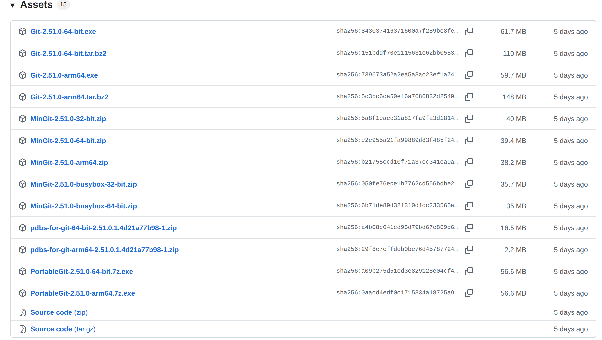

之后如果要启动Git的话 

进入要Git管理的文件夹 右键鼠标 点击 Git Bash

#### Ubuntu：

启动终端

```
sudo apt update
sudo apt-get install git
```

你可以输入

```
git
```

检查git是否安装成功

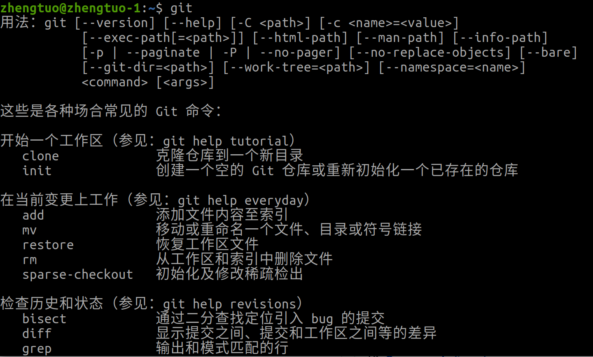

### 设置

设置自己的名字 邮箱 用于记录代码 不要直接复制哦

```
git config --global user.name  “0d00”
git config --global user.email "onani@0721.com"
```

生成ssh key 用于连接github 这里最好输入真实的邮箱

```
ssh-keygen -t rsa -C "onani@0721.com"
```

之后会弹出一堆问题 一直Enter即可 这个图是偷的

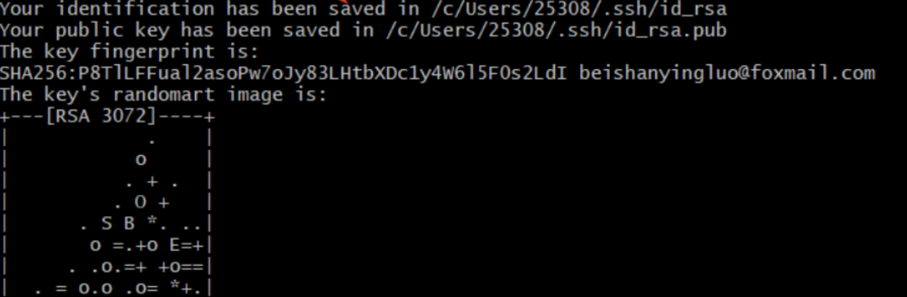

到了这里就可以找生成的key了

注意到上图 `Your public key has been saved in <路径>`

找到他 如果看不到 打开“显示隐藏的文件” Windows同理

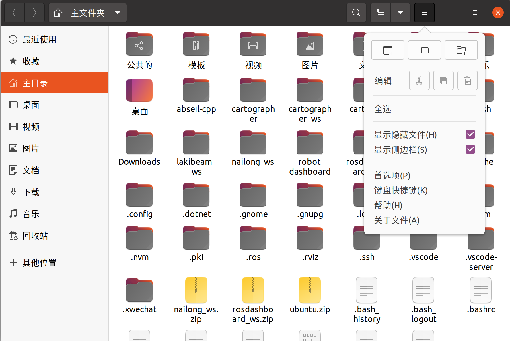

然后以文本格式 打开id_rsa.pub 复制内容

打开浏览器 访问github 注册账号 登陆

然后访问https://github.com/settings/keys

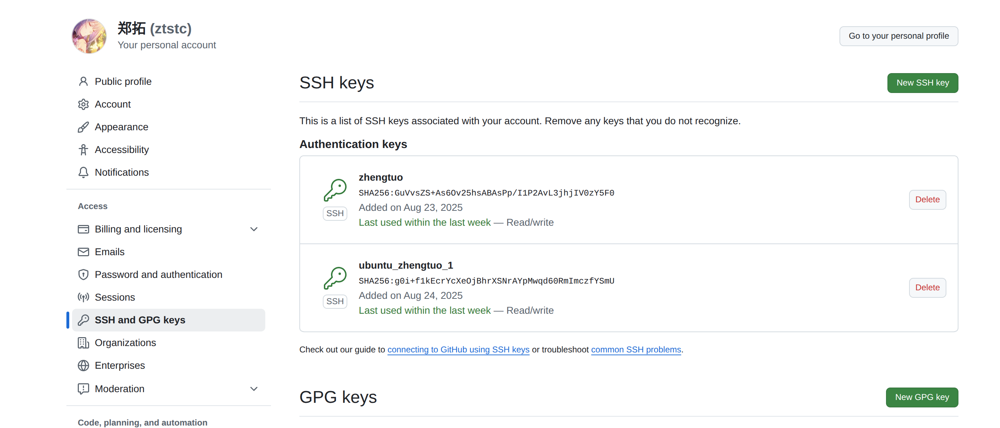

选择 “New SSH key”

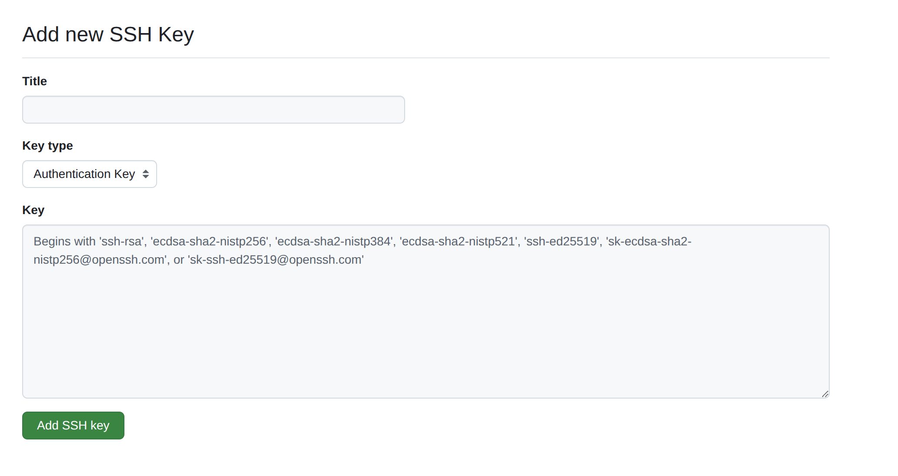

Title 随意 但是如果你的电脑安装了双系统 /你有好多电脑 你可以写成 computer1_ubuntu 便于区分

Key type不改

粘贴复制的id_rsa.pub内容到Key 

点Add SSH key即可

### 使用

来自https://www.cnblogs.com/-lhl/articles/18682953

三、Git基本操作
初始化仓库：在项目目录下执行`git init`，即可创建一个新的Git仓库。

添加文件到仓库：使用`git add` 命令将文件添加到暂存区，若要添加所有改动文件，则使用`git add .`。

提交更改：通过`git commit -m "<你的评论>"`命令将暂存区的改动提交到仓库中。

查看状态：使用`git status`命令可以随时查看当前仓库的状态，包括改动、暂存和未跟踪的文件信息。

查看日志：通过`git log`命令可以查看提交的历史记录，包括提交ID、作者、日期和提交信息。

四、Git分支管理
分支是Git中非常重要的概念，它允许我们在不影响主分支（main/master）的情况下进行新功能的开发和测试。

创建分支：使用git branch 命令创建新分支。

切换分支：通过git checkout 命令切换到指定分支。

合并分支：当新功能开发完成并测试通过后，可以使用git merge 命令将分支合并到主分支中。

删除分支：若分支不再需要，可以使用git branch -d 命令将其删除。

五、Git远程操作
在实际开发中，我们通常需要将本地仓库与远程仓库进行同步，以便团队成员之间共享代码和协作开发。

添加远程仓库：使用`git remote add` 命令添加远程仓库。

推送代码到远程仓库：通过`git push` 命令将本地分支的代码**推送**到远程仓库中。

从远程仓库拉取代码：使用`git pull` 命令从远程仓库中**拉取**最新代码并合并到当前分支中。

查看远程仓库信息：通过`git remote -v`命令可以查看当前配置的远程仓库信息。

## 2.使用GitHub对代码进行备份和分享

### 创建仓库

登陆https://github.com/

右上角有个+号 点 New repository 创建新仓库

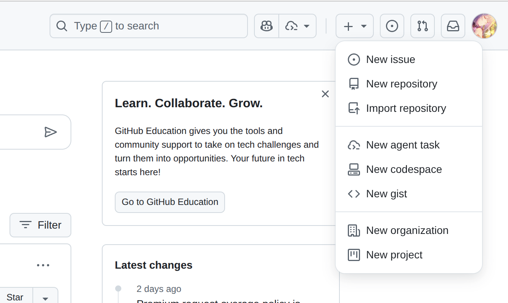

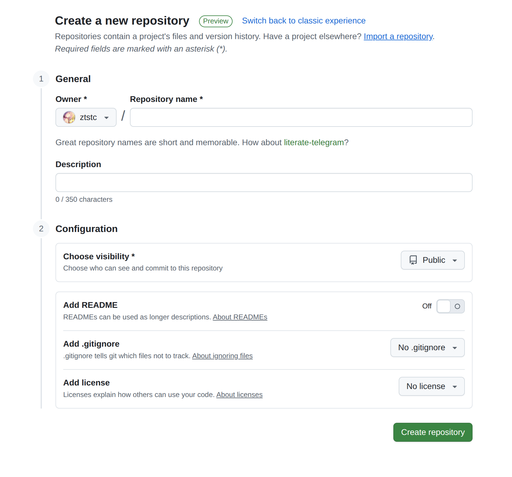

repository name是仓库名称

Description是对仓库的描述

visibility选择public则会让所有人看得到你的代码 private则是自己才能看到 建议Public

README是对代码的介绍 仓库根目录会增加readme.md供别人看

.gitignore是对某些无意义的文件的忽略设置 例如代码开发时的中间文件对他人而言纯粹是占用空间 设置.gitignore有助于提升上传速度，减少空间浪费

license是许可 感兴趣的可以自己了解 不想被复制的就No 开放的就MIT

然后Create就创建啦

### 上传文件

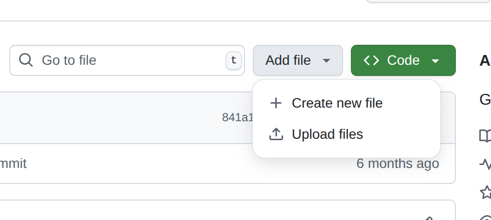

最暴力的方法就是直接 upload


聪明人选择Git工具上传

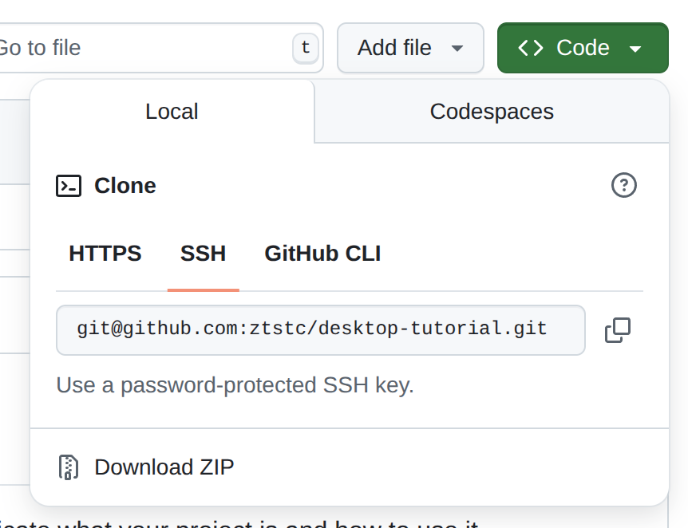

```
git init
git add .
git commit -m "提交项目相关信息"
git remote add origin git@github.com:ztstc/example.git #上图的SSH路径复制下！ 修改
git push -u origin main #现在master都改叫main了 主要是master有对内个歧视的意思（这也行？
```

### 下载文件

先创建文件夹存放要下载的东西

```
mkdir <目录名称>
cd /<目录名称>
```

访问项目存档的网页

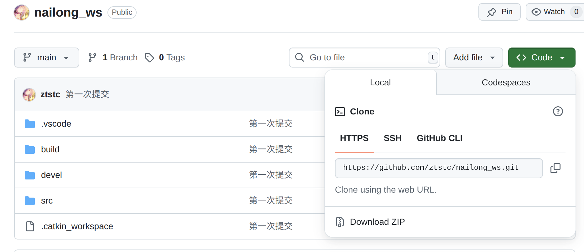

看到 Clone Https 复制链接

在终端输入

```
git clone <刚刚复制的链接>
```

如果网络没问题的话应该能工作咯

## 3.使用Copilot 协作代码生成 和利用学生认证获取免费的Copilot Pro

#### 学生认证

准备

0.你人在学校的同时使用手机访问github网页

1.你的学生证 要实体 它要直接调用相机拍照片 手机拍更方便

2.确保你的账户有 Two-factor authentication 认证 https://github.com/settings/security 建议手机安装Authenticator替代短信验证（压根没有+86的短信）

3.完善https://github.com/settings/billing/payment_information内的Billing information（不需要添加银行卡啥的，只需要完善地址 学校信息）

4.完善个人档案https://github.com/settings/profile 名字必须和学生证对应 学校 城市都填下

访问链接

https://github.com/settings/education/benefits?locale=en-US

点击Start an application跟着流程走即可

这里附通过和失败的截图

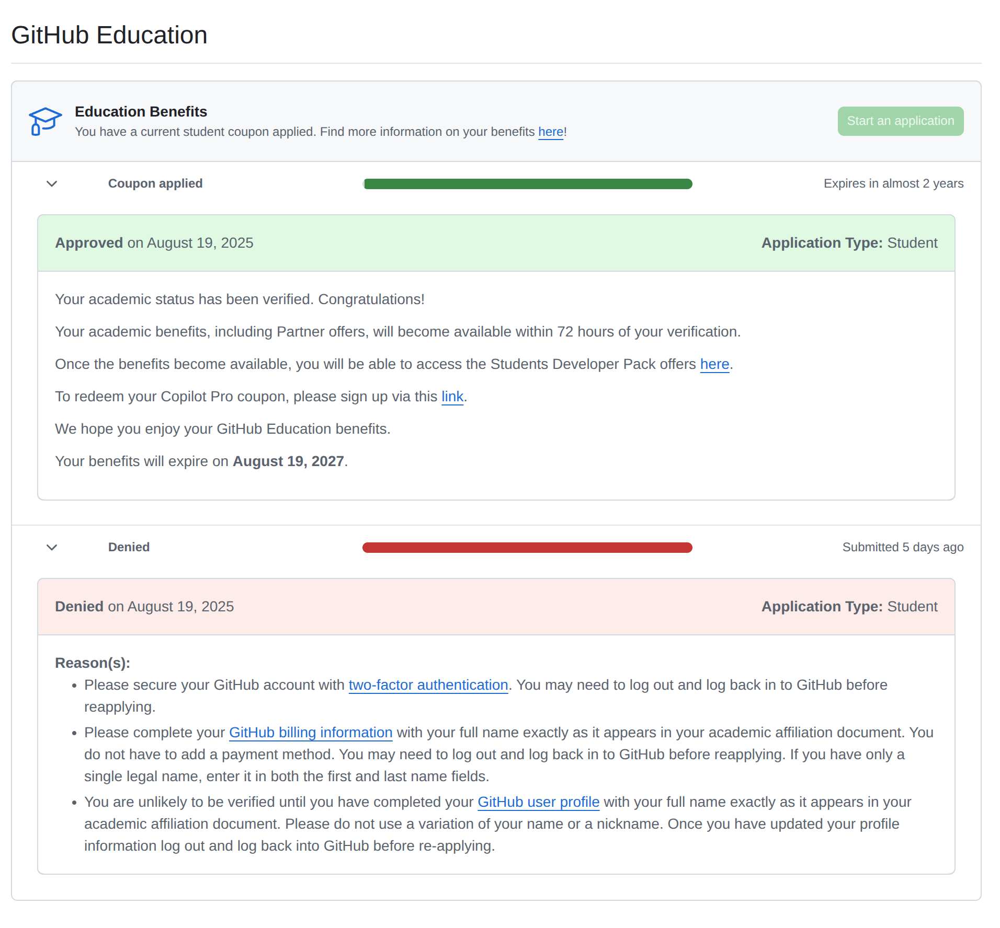

看到了绿色通过先别激动 还得等72小时激活权益

激活了之后点击链接

https://github.com/settings/copilot/features

确认你的Copilot Pro

然后就能在VsCode安装copilot插件 享受等值10usd/month的Copilot Pro了！